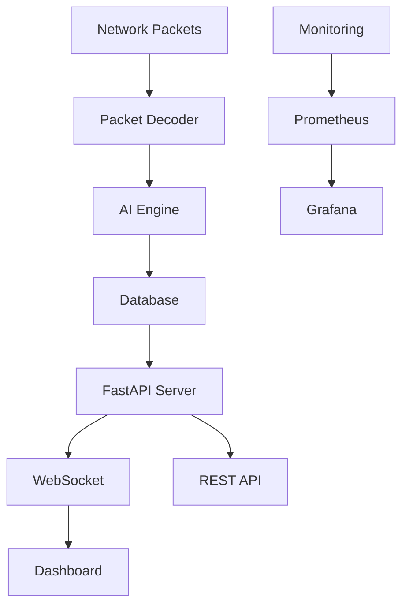

# 🎰 Two Very Auto Casino System

[](https://github.com/Jason8055/two_very_auto/actions/workflows/ci.yml)
[](https://github.com/Jason8055/two_very_auto/actions/workflows/security.yml)
[](LICENSE)
[](https://python.org)
[](https://codecov.io/gh/Jason8055/two_very_auto)

An advanced, AI-powered casino monitoring and analysis system featuring real-time packet analysis, predictive modeling, and comprehensive dashboard visualization for baccarat games.

## 🌟 Features

### 🔍 Real-time Monitoring
- **Packet Analysis**: Advanced network packet capture and decoding
- **Live Dashboard**: Real-time WebSocket-powered visualization
- **Multi-table Support**: Monitor multiple baccarat tables simultaneously
- **Pattern Recognition**: AI-powered game pattern detection

### 🤖 AI & Machine Learning
- **Predictive Engine**: Machine learning models for outcome prediction
- **Advanced Analytics**: Statistical analysis and trend identification  
- **Adaptive Learning**: Models that improve with more data
- **Performance Metrics**: Comprehensive prediction accuracy tracking

### 🏗️ Architecture
- **FastAPI Backend**: High-performance async API service
- **WebSocket Integration**: Real-time bidirectional communication
- **Database Management**: Optimized SQLite/PostgreSQL support
- **Docker Ready**: Full containerization support
- **Microservices**: Scalable microservice architecture

### 📊 Monitoring & Observability  
- **Prometheus Metrics**: Comprehensive system metrics
- **Grafana Dashboards**: Rich visualization and alerting
- **Health Checks**: Automated system health monitoring
- **Performance Tracking**: Request/response time monitoring

## 🚀 Quick Start

### Prerequisites
- Python 3.10 or higher
- Docker and Docker Compose (optional)
- PostgreSQL or SQLite (for data storage)

### Installation

1. **Clone the repository**
   ```bash
   git clone https://github.com/Jason8055/two_very_auto.git
   cd two_very_auto
   ```

2. **Set up Python environment**
   ```bash
   python -m venv venv
   source venv/bin/activate  # Windows: venv\Scripts\activate
   pip install -e ".[dev,test]"
   ```

3. **Configure environment**
   ```bash
   cp .env.example .env
   # Edit .env with your configuration
   ```

4. **Initialize database**
   ```bash
   cd python
   python database_manager.py --init
   ```

5. **Start the services**
   ```bash
   # Option 1: Direct Python execution
   python python/fastapi_app/main.py
   
   # Option 2: Docker Compose (recommended)
   docker-compose up -d
   ```

6. **Access the dashboard**
   - Web Dashboard: http://localhost:8000
   - API Documentation: http://localhost:8000/docs
   - Metrics: http://localhost:9090

## 📖 Documentation

### Architecture Overview



### Core Components

| Component | Description | Technology |
|-----------|-------------|------------|
| **Packet Decoder** | Network packet capture and analysis | Python, Scapy |
| **AI Engine** | Predictive modeling and pattern recognition | scikit-learn, TensorFlow |
| **FastAPI Server** | High-performance web API | FastAPI, Uvicorn |
| **Database Layer** | Data persistence and querying | SQLAlchemy, PostgreSQL/SQLite |
| **WebSocket Service** | Real-time communication | WebSockets, asyncio |
| **Monitoring** | System observability | Prometheus, Grafana |

### API Endpoints

#### Game Data
- `GET /api/v1/games` - List recent games
- `GET /api/v1/games/{game_id}` - Get specific game details
- `POST /api/v1/games/analyze` - Analyze game patterns

#### Predictions
- `GET /api/v1/predictions/current` - Get current predictions
- `POST /api/v1/predictions/train` - Retrain AI models
- `GET /api/v1/predictions/accuracy` - Get model accuracy metrics

#### Real-time
- `WebSocket /ws/live` - Live game updates
- `WebSocket /ws/predictions` - Real-time prediction updates

## 🛠️ Development

### Setting up Development Environment

1. **Install development dependencies**
   ```bash
   pip install -e ".[dev,test,security]"
   pre-commit install
   ```

2. **Run quality checks**
   ```bash
   # Linting and formatting
   ruff check python/
   black python/
   
   # Type checking
   mypy python/
   
   # Security scanning
   bandit -r python/
   
   # Tests
   pytest
   ```

3. **Docker development**
   ```bash
   # Build development images
   docker-compose -f docker-compose.dev.yml up -d
   
   # View logs
   docker-compose logs -f
   ```

### Project Structure

```
two_very_auto/
├── python/                     # Main Python application
│   ├── fastapi_app/           # FastAPI web service
│   │   ├── main.py           # Application entry point
│   │   ├── routers/          # API route definitions
│   │   ├── services/         # Business logic services
│   │   └── models/           # Database models
│   ├── ai_prediction_engine.py  # Machine learning engine
│   ├── packet_decoder.py       # Network packet analysis
│   └── database_manager.py     # Database operations
├── docker/                     # Docker configuration
│   ├── Dockerfile.web         # Web service container
│   ├── Dockerfile.ai          # AI service container
│   └── docker-compose.yml     # Service orchestration
├── deployment/                 # Deployment automation
│   ├── kubernetes/            # K8s manifests
│   └── terraform/             # Infrastructure as code
├── monitoring/                 # Observability stack
│   ├── prometheus/            # Metrics collection
│   └── grafana/              # Visualization
└── .github/                   # CI/CD workflows
```

### Testing

```bash
# Run all tests
pytest

# Run with coverage
pytest --cov=python --cov-report=html

# Run specific test categories
pytest -m unit          # Unit tests only
pytest -m integration   # Integration tests only
pytest -m security      # Security tests only
```

### Performance Testing

```bash
# API performance testing
cd python/fastapi_app
python performance_benchmark.py

# Load testing with Locust
locust -f tests/load_test.py --host=http://localhost:8000
```

## 🔐 Security

### Security Features
- **Input Validation**: Comprehensive request validation
- **Rate Limiting**: API endpoint protection
- **Authentication**: JWT-based user authentication
- **Encryption**: AES-256 data encryption at rest
- **TLS/SSL**: Encrypted communication channels
- **Audit Logging**: Complete audit trail

### Security Best Practices
- Never commit secrets to version control
- Use environment variables for sensitive configuration
- Regularly update dependencies via Dependabot
- Run security scans before deployment
- Follow OWASP security guidelines

See [SECURITY.md](SECURITY.md) for detailed security information and vulnerability reporting.

## 📊 Monitoring & Metrics

### Key Metrics
- **System Performance**: CPU, memory, disk usage
- **API Metrics**: Request rate, response time, error rate
- **Game Analytics**: Win rates, pattern accuracy, prediction success
- **Database Performance**: Query time, connection pool status

### Dashboards
- **System Health**: Infrastructure monitoring
- **Game Analytics**: Business intelligence dashboards
- **Performance Metrics**: Application performance monitoring
- **Security Monitoring**: Security event tracking

## 🚀 Deployment

### Production Deployment

1. **Using Docker Compose**
   ```bash
   # Production configuration
   docker-compose -f docker-compose.prod.yml up -d
   ```

2. **Kubernetes Deployment**
   ```bash
   # Apply manifests
   kubectl apply -f deployment/kubernetes/
   
   # Check status
   kubectl get pods -n two-very-auto
   ```

3. **AWS/Cloud Deployment**
   ```bash
   # Terraform infrastructure
   cd deployment/terraform
   terraform init && terraform apply
   ```

### Environment Configuration

| Environment | Description | Configuration |
|-------------|-------------|---------------|
| Development | Local development | `.env.development` |
| Staging | Pre-production testing | `.env.staging` |
| Production | Live system | `.env.production` |

## 🤝 Contributing

We welcome contributions! Please see [CONTRIBUTING.md](CONTRIBUTING.md) for detailed guidelines.

### How to Contribute
1. Fork the repository
2. Create a feature branch (`git checkout -b feature/amazing-feature`)
3. Make your changes and add tests
4. Ensure all quality checks pass
5. Create a Pull Request

### Code of Conduct
- Be respectful and inclusive
- Focus on constructive feedback
- Help create a welcoming environment

## 📜 License

This project is licensed under the MIT License - see the [LICENSE](LICENSE) file for details.

**Important**: This software is intended for educational and research purposes. Users are responsible for ensuring compliance with applicable laws and regulations in their jurisdiction.

## 📞 Support

- **Issues**: [GitHub Issues](https://github.com/Jason8055/two_very_auto/issues)
- **Discussions**: [GitHub Discussions](https://github.com/Jason8055/two_very_auto/discussions)
- **Security**: See [SECURITY.md](SECURITY.md) for security-related concerns

## 🏆 Acknowledgments

- FastAPI team for the excellent web framework
- scikit-learn contributors for machine learning capabilities
- The open-source community for various tools and libraries

---

⭐ **Star this repository if you find it helpful!**